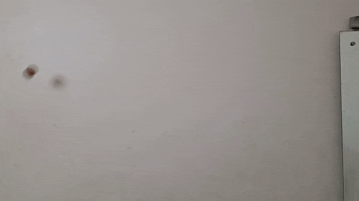

- ## Discovering motion from video
Tracks a red ball in video frames using OpenCV, learns a closed-form motion equation via symbolic regression (PySR), and overlays the predicted path back on the video.

Outputs will be saved to `Outputs/`:
- `ball_trajectory.csv` — tracked positions
- `yx_equation_pixel.txt` — learned equation
- `overlay_output.mp4` — video with predicted path

- ## Example Output

